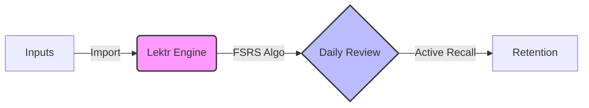

<div align="center">
  <h1 align="center">Lektr</h1>
  <h3 align="center">Your Personal Knowledge Retention Engine</h3>

  <p align="center">
    A self-hosted, local-first platform to aggregate, organize, and <b>retain</b> your reading highlights using active recall.
  </p>

  <p align="center">
    <a href="https://github.com/lektr/lektr/stargazers">
      
    </a>
    <a href="https://github.com/lektr/lektr/network/members">
      
    </a>
    <a href="https://github.com/lektr/lektr/issues">
      
    </a>
  </p>
</div>

> [!IMPORTANT]
> **Lektr is currently in early development.**
>
> We are actively building the foundation and things might change rapidly, expect bugs and errors for now. We welcome start contributors and feedback! Please check our [Issues](https://github.com/lektr/lektr/issues) to see what we're working on.

---

## 📖 About

**Lektr** is a self-hosted application designed for avid readers who want to **retain** what they read. It consolidates highlights from your e-readers and apps into one beautiful interface, then helps you **internalize** those ideas through daily spaced-repetition reviews.

Unlike closed platforms, Lektr is **local-first** and **open source**. Your data lives on your server, under your control.

## 🧠 How It Works

Lektr is built on a simple loop: **Aggregate → Review → Retain.**



### 1. Aggregate Your Highlights

Bring all your reading notes into one place. Lektr supports:

- **Kindle** (`My Clippings.txt`)
- **KOReader** (metadata JSON export)
- **Readwise** (CSV export)
- **Manual Entry**

### 2. Review Daily

Lektr uses a spaced repetition algorithm (FSRS) to surface highlights right before you're about to forget them. Spend 5 minutes a day reviewing to **internalize** key insights.

### 3. Retain & Apply

Build a true "Second Brain."

- **Semantic Search**: Find concepts even if you don't remember the exact words.
- **Tagging**: Organize ideas your way.
- **Export**: Send your retention deck to **Obsidian**, **Notion**, or **Markdown**.

---

## ✨ Why Choose Lektr?

### Stop Forgetting

Most people forget 90% of what they read within a week. Lektr's active recall system prevents this leakage.

### Escape the Subscription Trap

Unlike other tools that charge monthly fees for your own data, Lektr is:

- **100% Free & Open Source (Apache 2.0)**
- **Self-Hosted** (Docker)
- **Local-First** (Privacy focused)

### Beautifully Organized

Automatic cover art and metadata enrichment via Hardcover and Open Library keep your library looking pristine.

## 🚀 Deploy with Docker

Getting started is easy with Docker Compose.

1. **Clone the repository:**

   ```bash
   git clone https://github.com/lektr/lektr.git
   cd lektr
   ```

2. **Configure environment:**
   Copy the example environment file and update it with your settings.

   ```bash
   cp .env.example .env
   ```

   _Edit `.env` to add your optional `HARDCOVER_API_KEY` for better book covers._

3. **Start the services:**

   ```bash
   docker compose up -d
   ```

4. **Access Lektr:**
   Open `http://localhost:80` (or `http://localhost:${LEKTR_PORT}`) in your browser.

## 🤝 Support the Project

If you love Lektr and want to support its development, consider donating via Open Collective! Your support helps cover server costs and fuels new feature development.

<a href="https://opencollective.com/lektr">
  
</a>

## ⭐ Star the Project

If you find Lektr useful, please give it a star on GitHub! It helps more people discover the project.

[](https://github.com/lektr/lektr)

## 🛠️ Development

To run Lektr locally for development:

```bash
# Install dependencies
npm install

# Start development server
docker compose -f docker-compose.dev.yml up
```

## 📊 Telemetry

Lektr collects **anonymous usage statistics** (e.g., feature usage counts, library size) to help improve the product. No personal data or highlight content is ever transmitted.

**To opt out:**

- Via UI: Go to **Admin Settings** → Toggle "Telemetry" off
- Via Environment: Set `POSTHOG_API_KEY=disabled` in your `.env` file

## 🔐 Security

For production deployments, always set `JWT_SECRET` to a strong, random value:

```bash
# Generate a secure secret
openssl rand -base64 32
```

Add it to your `.env`:

```bash
JWT_SECRET=your-generated-secret-here
```

## 📄 License

[Apache License 2.0](LICENSE) © 2026 Lektr.app
