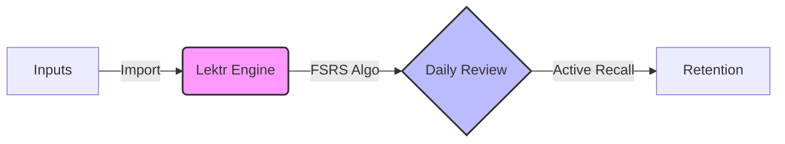

<div align="center">
  <h1 align="center">Lektr</h1>
  <h3 align="center">Your Personal Knowledge Retention Engine</h3>

  <p align="center">
    A self-hosted, local-first platform to aggregate, organize, and <b>retain</b> your reading highlights using active recall.
  </p>

  <p align="center">
    <a href="https://github.com/lektr/lektr/stargazers">
      
    </a>
    <a href="https://github.com/lektr/lektr/network/members">
      
    </a>
    <a href="https://github.com/lektr/lektr/issues">
      
    </a>
    <a href="https://github.com/lektr/lektr/releases">
      
    </a>
  </p>

  <!-- TODO: Replace with actual screenshot -->
  <!--  -->
</div>

> [!IMPORTANT]
> **Lektr is currently in early development.**
>
> We are actively building the foundation and things might change rapidly — expect bugs and rough edges for now. We welcome early contributors and feedback! Please check our [Issues](https://github.com/lektr/lektr/issues) to see what we're working on.

---

## 📖 About

**Lektr** is a self-hosted application designed for avid readers who want to **retain** what they read. It consolidates highlights from your e-readers and apps into one beautiful interface, then helps you **internalize** those ideas through daily spaced-repetition reviews.

Unlike closed platforms, Lektr is **local-first** and **open source**. Your data lives on your server, under your control.

## 🧠 How It Works

Lektr is built on a simple loop: **Aggregate → Review → Retain.**



### 1. Aggregate Your Highlights

Bring all your reading notes into one place. Lektr supports:

- **Kindle** (`My Clippings.txt`, Auto Sync)
- **KOReader** (metadata JSON export via plugin)
- **Readwise** (CSV export)
- **Browser Extension** (Save web highlights)
- **Mobile App** (Share text directly from any app)
- **Manual Entry**

### 2. Review & Retain

Lektr gives you two powerful ways to internalize knowledge:

- **Frictionless Book Study**: Dive into a specific book without setup. Lektr automatically turns your raw highlights into "Virtual Flashcards" for immediate review.
- **Spaced Repetition (SRS)**: For long-term retention, add flashcards to decks. The FSRS algorithm schedules reviews exactly when you're about to forget them, ensuring efficient, lifetime memory.

### 3. Organize & Search

- **Semantic Search**: Find concepts even if you don't remember the exact words.
- **Tagging**: Organize ideas your way.
- **Auto-enrichment**: Automatic cover art and metadata via Hardcover and Open Library.

---

## ✨ Why Choose Lektr?

### Stop Forgetting

Most people forget 90% of what they read within a week. Lektr's active recall system prevents this leakage.

### Zero Friction

Don't want to manage decks? No problem. **Virtual Flashcards** let you study raw highlights immediately. Convert them to permanent SRS cards only when you want to commit them to long-term memory.

### Escape the Subscription Trap

Unlike other tools that charge monthly fees for your own data, Lektr can be deployed to your own hardware for free, self-hosted, and open source instance.

### How Lektr Compares

| Feature               |   Lektr   | Readwise |   Anki    |
| --------------------- | :-------: | :------: | :-------: |
| Self-hosted           |    ✅     |    ❌    |    ✅     |
| Kindle sync           |    ✅     |    ✅    |    ❌     |
| Spaced repetition     | ✅ (FSRS) |    ❌    | ✅ (SM-2) |
| Highlight aggregation |    ✅     |    ✅    |    ❌     |
| Browser extension     |    ✅     |    ✅    |    ❌     |
| Semantic search       |    ✅     |    ❌    |    ❌     |
| Free & open source    |    ✅     |    ❌    |    ✅     |
| Runs on Raspberry Pi  |    ✅     |    ❌    |    ❌     |

---

## 📱 Supported Platforms

| Platform                                 | Status                |
| ---------------------------------------- | --------------------- |
| **Web App** (Docker)                     | ✅ Available          |
| **Android** (React Native)               | ✅ Available          |
| **iOS** (React Native)                   | ✅ Available          |
| **Browser Extension** (Chrome / Firefox) | ✅ Available          |
| **Docker** (AMD64 + ARM64)               | ✅ Raspberry Pi ready |

---

## 🏗️ Architecture

```
┌─────────────┐     ┌──────────────────────────┐     ┌────────────┐
│  Mobile App │────▶│       Lektr API           │◀────│  Browser   │
│ (React      │     │  (Hono + Drizzle ORM)     │     │ Extension  │
│  Native)    │     └────────────┬───────────────┘     └────────────┘
└─────────────┘                  │
                    ┌────────────┴───────────────┐
                    │     PostgreSQL Database     │
                    └────────────────────────────┘
                    ┌────────────────────────────┐
                    │   React Frontend (Vite)    │
                    └────────────────────────────┘
```

**Tech Stack:**

- **API**: Hono (TypeScript), Drizzle ORM, OpenAPI
- **Frontend**: React 19, Vite, Vanilla CSS
- **Mobile**: React Native (Expo), WatermelonDB offline-first sync
- **Database**: PostgreSQL
- **Search**: Local ONNX embeddings (ARM64-compatible, no cloud APIs)
- **Containerization**: Docker (multi-arch: AMD64 + ARM64)

---

## 🚀 Quick Start with Docker

The recommended way to run Lektr is using Docker.

### Prerequisites

- Docker and Docker Compose v2+
- At least 2GB RAM recommended

### Installation

1. **Create a project directory:**

   ```bash
   mkdir lektr && cd lektr
   ```

2. **Download config:**

   ```bash
   curl -O https://raw.githubusercontent.com/lektr/lektr/main/docker-compose.yml
   ```

   _Alternatively, clone the full repository:_

   ```bash
   git clone https://github.com/lektr/lektr.git
   cd lektr
   ```

3. **Configure environment:**

   Create a `.env` file (optional but recommended for production):

   ```bash
   # Security - REQUIRED for production!
   # Generate with: openssl rand -base64 32
   JWT_SECRET=your-very-long-secret-key-at-least-32-chars

   # Admin User (Default: admin@lektr.local / admin123)
   ADMIN_EMAIL=your@email.com
   ADMIN_PASSWORD=your-secure-password

   # Database
   POSTGRES_PASSWORD=your-secure-db-password

   # Optional
   HARDCOVER_API_KEY=your-hardcover-api-key # For book metadata
   LEKTR_PORT=80 # Change if port 80 is in use
   ```

4. **Start the services:**

   ```bash
   docker compose up -d
   ```

5. **Access Lektr:**
   - Open `http://localhost` (or your configured port)
   - Default login: `admin@lektr.local` / `admin123`
   - **Important:** Change the password immediately!

## 🔄 Updating

To update to the latest version:

```bash
docker compose pull
docker compose up -d
```

---

## 🛠️ Development

To run Lektr locally for development:

```bash
# Clone the repository
git clone https://github.com/lektr/lektr.git
cd lektr

# Install dependencies
npm install

# Start development server
docker compose -f docker-compose.dev.yml up
```

See the [Contributing Guide](CONTRIBUTING.md) for development setup details, coding standards, and how to submit pull requests.

## 🤝 Contributing

We welcome contributions of all kinds — bug reports, feature requests, documentation improvements, and code changes.

1. **Find an issue** — Check [open issues](https://github.com/lektr/lektr/issues) or create a new one
2. **Fork & branch** — Create a feature branch from `main`
3. **Make your changes** — Follow existing code style and conventions
4. **Submit a PR** — Reference the issue number in your pull request

---

## 🔐 Security

For production deployments, always set `JWT_SECRET` to a strong, random value:

```bash
# Generate a secure secret
openssl rand -base64 32
```

## 📊 Telemetry

Lektr collects **anonymous usage statistics** (e.g., feature usage counts, library size) to help improve the product. No personal data or highlight content is ever transmitted.

**To opt out:**

- Via UI: Go to **Admin Settings** → Toggle "Telemetry" off
- Via Environment: Set `POSTHOG_API_KEY=disabled` in your `.env` file

---

## 🤝 Support the Project

If you love Lektr and want to support its development, consider donating via Open Collective! Your support helps cover server costs and fuels new feature development.

<a href="https://opencollective.com/lektr">
  
</a>

## ⭐ Star the Project

If you find Lektr useful, please give it a star on GitHub! It helps more people discover the project.

[](https://github.com/lektr/lektr)

## 📄 License

[Apache License 2.0](LICENSE) © 2026 Lektr.app
